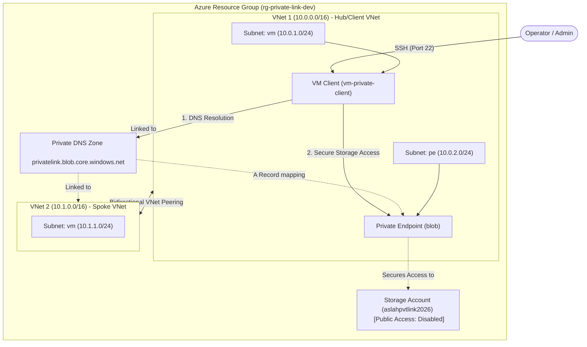

# 🌐 Azure Private Link & Private DNS Terraform Lab
[](https://www.terraform.io/)
[](https://azure.microsoft.com/)
[](LICENSE)


An enterprise-grade, modular Terraform lab demonstrating a **Zero Trust** private network architecture on Microsoft Azure. This project showcases how to isolate an Azure Storage Account (Blob Service), disable its public endpoint, and establish secure access exclusively through a **Private Endpoint** and custom **Private DNS Zone** topology.

---

## 🗺️ Architectural Topology

This lab implements a dual-VNet structure with bidirectional peering. A client VM in VNet 1 simulates a secure workstation accessing the isolated storage account over the private Microsoft backbone network.



---

## 🚀 Key Features

*   **Virtual Network Topology:** Deploy dual virtual networks (`vnet-dev-1` and `vnet-dev-2`) configured with dynamic subnets for virtual machines and dedicated private endpoints.
*   **Virtual Network Peering:** Establishes full bidirectional peering between the VNets, confirming cross-VNet private link resolution.
*   **Azure Private Endpoint:** Binds the Azure Storage Account blob sub-resource securely to the private subnet inside `vnet-dev-1`.
*   **Private DNS Zone Integration:** Automates the deployment of the `privatelink.blob.core.windows.net` zone, registers local A records targeting the private endpoint IP, and links both VNets to ensure clean name resolution.
*   **Secure Client VM:** Deploys a hardened Linux Virtual Machine configured with automated SSH key generation (`tls_private_key`) to validate the network pathways.
*   **Enforced Access Controls:** Fully disables public network access on the storage account (`public_network_access_enabled = false`), enforcing routing strictly through the private link.

---

## 📁 Repository Structure

The project utilizes a highly modular structure allowing for clean separation of concerns and reuse across `dev`, `stage`, and `prod` environments.

```text
├── environments
│   ├── dev/                 # Target environment for the lab
│   │   ├── main.tf          # Configures resources using modules
│   │   ├── variables.tf     # Dev environment variables
│   │   ├── terraform.tfvars # Dev configuration values
│   │   ├── providers.tf     # Azure provider definitions
│   │   └── backend.tf       # Remote/local state configuration
│   ├── stage/               # Staging configuration placeholder
│   └── prod/                # Production configuration placeholder
├── modules                  # Custom re-usable infrastructure blocks
│   ├── resource_group/      # Standard resource group module
│   ├── network/             # VNet, subnets, and peering configurations
│   ├── storage_account/     # Secure Storage Account creation
│   ├── private_endpoint/    # Private link endpoint configuration
│   ├── private_dns/         # Private DNS Zone and VNet linking
│   └── linux_vm/            # Linux VM provisioning with SSH key generation
└── LICENSE                  # MIT License file
```

---

## ⚙️ Module Specifications

### 1. Network Module (`modules/network`)
Provisions multiple VNets and their respective subnets. It dynamically handles the creation of VNet Peering relations.
*   **Input Variables:** `vnets` (map of VNets and subnets specifications).
*   **Special Feature:** Automatic disabling of private endpoint network policies (`private_endpoint_network_policies = "Disabled"`) to allow private IP assignment.

### 2. Storage Account Module (`modules/storage_account`)
Configures the target storage resources.
*   **Security Controls:** Enforces TLS 1.2 minimum, enables `is_https_only_enabled = true`, and sets `public_network_access_enabled = false`.

### 3. Private Endpoint Module (`modules/private_endpoint`)
Exposes the storage resource privately.
*   **Target Subresource:** `blob` API.
*   **Output:** Returns the Private Endpoint's dynamically assigned Private IP address.

### 4. Private DNS Module (`modules/private_dns`)
Creates `privatelink.blob.core.windows.net` and dynamically links all provided VNets to make the DNS records resolvable inside them.

---

## 🛠️ Deployment Instructions

### Prerequisites
1.  [Azure CLI](https://learn.microsoft.com/en-us/cli/azure/install-azure-cli) installed and authenticated (`az login`).
2.  [Terraform CLI](https://developer.hashicorp.com/terraform/downloads) (v1.5.0+ recommended).

### Step-by-Step Deployment
1.  **Navigate to the Dev environment:**
    ```bash
    cd environments/dev
    ```

2.  **Initialize Terraform:**
    ```bash
    terraform init
    ```

3.  **Perform a dry-run plan:**
    ```bash
    terraform plan
    ```

4.  **Apply the configuration:**
    ```bash
    terraform apply --auto-approve
    ```

5.  **Extract the Private SSH Key for Client VM:**
    ```bash
    # Extracts the generated private key to authenticate with the VM
    terraform output -raw private_key_pem > client_vm_key.pem
    chmod 400 client_vm_key.pem
    ```

---

## 🧪 Verification & Validation Workouts

After deploying, perform the following validation commands to prove that public access is blocked and the private link is functional:

### 1. Attempt Public Access (Expect Failure)
Try accessing the storage account endpoint from your local machine (outside the VNet):
```bash
curl -I https://aslahpvtlink2026.blob.core.windows.net
```
> [!IMPORTANT]
> This command should return an HTTP 403 Forbidden or network timeout response because public network access has been disabled.

### 2. Access the Client VM via SSH
Use the extracted private key to log into the client VM:
```bash
SSH_IP=$(terraform output -raw vm_public_ip)
ssh -i client_vm_key.pem azureuser@$SSH_IP
```

### 3. Verify Private DNS Resolution inside VNet (Expect Success)
Run `nslookup` inside the client VM to check if the storage account domain resolves to the Private Endpoint IP address (`10.0.2.x`):
```bash
nslookup aslahpvtlink2026.blob.core.windows.net
```
*Expected Output:*
```text
Server:         127.0.0.53
Address:        127.0.0.53#53

Non-authoritative answer:
aslahpvtlink2026.blob.core.windows.net   canonical name = aslahpvtlink2026.privatelink.blob.core.windows.net.
Name:   aslahpvtlink2026.privatelink.blob.core.windows.net
Address: 10.0.2.4
```

### 4. Verify Private API Access inside VNet
From the VM, execute a command to write to or read from the storage account using the Azure CLI or curl. Since the traffic routes via the internal peered networks, access is granted.

---

## 🔒 Security Best Practices Implemented

> [!TIP]
> *   **Zero Trust Perimeter**: The Storage Account is completely isolated from the internet.
> *   **Minimal SSH Access**: SSH rules inside the NSG can be locked down to specific source IP ranges for production.
> *   **Automatic Key Generation**: Private SSH keys are generated in-memory during provisioning using Terraform's TLS provider rather than being stored statically in repository files.

---

## 📄 License

This project is licensed under the MIT License - see the [LICENSE](LICENSE) file for details.

